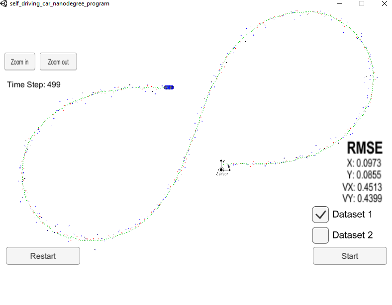
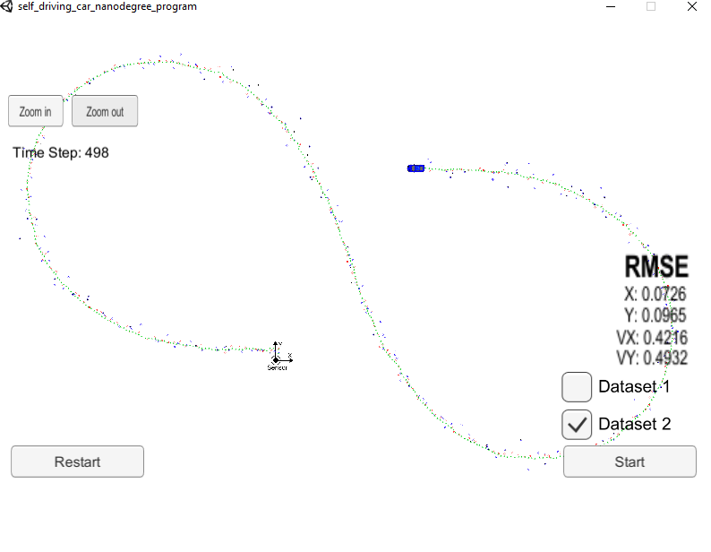

# Extended Kalman Filter Project

This project involves the Term 2 Simulator which can be downloaded [here](https://github.com/udacity/self-driving-car-sim/releases).  
Tips for setting up your environment can be found. [here](https://classroom.udacity.com/nanodegrees/nd013/parts/40f38239-66b6-46ec-ae68-03afd8a601c8/modules/0949fca6-b379-42af-a919-ee50aa304e6a/lessons/f758c44c-5e40-4e01-93b5-1a82aa4e044f/concepts/23d376c7-0195-4276-bdf0-e02f1f3c665d)

The main goal of the project is to apply Extended Kalman Filter to fuse data from LIDAR and Radar sensors of a self driving car using C++.

## Other Important Dependencies

* cmake >= 3.5
  * All OSes: [click here for installation instructions](https://cmake.org/install/)
* make >= 4.1 (Linux, Mac), 3.81 (Windows)
  * Linux: make is installed by default on most Linux distros
  * Mac: [install Xcode command line tools to get make](https://developer.apple.com/xcode/features/)
  * Windows: [Click here for installation instructions](http://gnuwin32.sourceforge.net/packages/make.htm)
* gcc/g++ >= 5.4
  * Linux: gcc / g++ is installed by default on most Linux distros
  * Mac: same deal as make - [install Xcode command line tools](https://developer.apple.com/xcode/features/)
  * Windows: recommend using [MinGW](http://www.mingw.org/)

## Basic Build Instructions

1. Clone this repo.
2. Make a build directory: `mkdir build && cd build`
3. Compile: `cmake .. && make`
4. Run it: `./ExtendedKF `

## Content of this repo
- `scr` a directory with the project code:
  - `main.cpp` - reads in data, calls a function to run the Kalman filter, calls a function to calculate RMSE
  - `FusionEKF.cpp` - initializes the filter, calls the predict function, calls the update function
  - `kalman_filter.cpp`- defines the predict function, the update function for lidar, and the update function for radar
  - `tools.cpp` - a function to calculate RMSE and the Jacobian matrix
- `data`  a directory with two input files, provided by Udacity
- `images`  a directory with the results
- `Docs` a directory with files formats description

## Principles:

There are many pieces in a Kalman Filter based sensor fusion. We have two sensors, a lidar and a radar. The information provided by these sensors is used to estimate the state of a moving pedestrian, and this state is represented by a 2D position and a 2D velocity. Each time we received new measurements from a given sensor, the estimation function is triggered. At this point we perform two steps, **State Prediction** and **Measurement Update**.

In the *Prediction* step, we predict the pedestrian *state* and its *covariance*. We do so by taking into account the elapsed time between the current and the previous observations.

The *measurement update* step depends on sensor type. There are two cases that we'll see, **Laser** and **Radar**. If the current measurements are generated by a laser sensor, then we just apply a standard **Kalman filter** to update the pedestrian's state. However, *radar measurements* involve a *nonlinear measurement function*. So when we receive radar measurements, we use different tweaks to handle the measurement update. For instance we may use **Extended Kalman Filter** equations.

* **first measurement** -  the filter will receive initial measurements of the car's position relative to the car. These measurements will come from a radar or lidar sensor.
* **initialize state and covariance matrices** - the filter will initialize the car's position based on the first measurement.
* then the car will receive another sensor measurement after a time period Δt
* **predict** - the algorithm will predict where the car will be after time Δt. One basic way to predict the car location after Δt is to assume the car's velocity is constant; thus the car will have moved velocity * Δt.
* **update** - the filter compares the "*predicted*" location with what the sensor *measurement* says. The predicted location and the measured location are combined to give an updated location. The Kalman filter will put more weight on either the predicted location or the measured location depending on the uncertainty of each value.
* then the car will receive another sensor measurement after a time period Δt. The algorithm then does another *predict* and *update* step.

## Results

